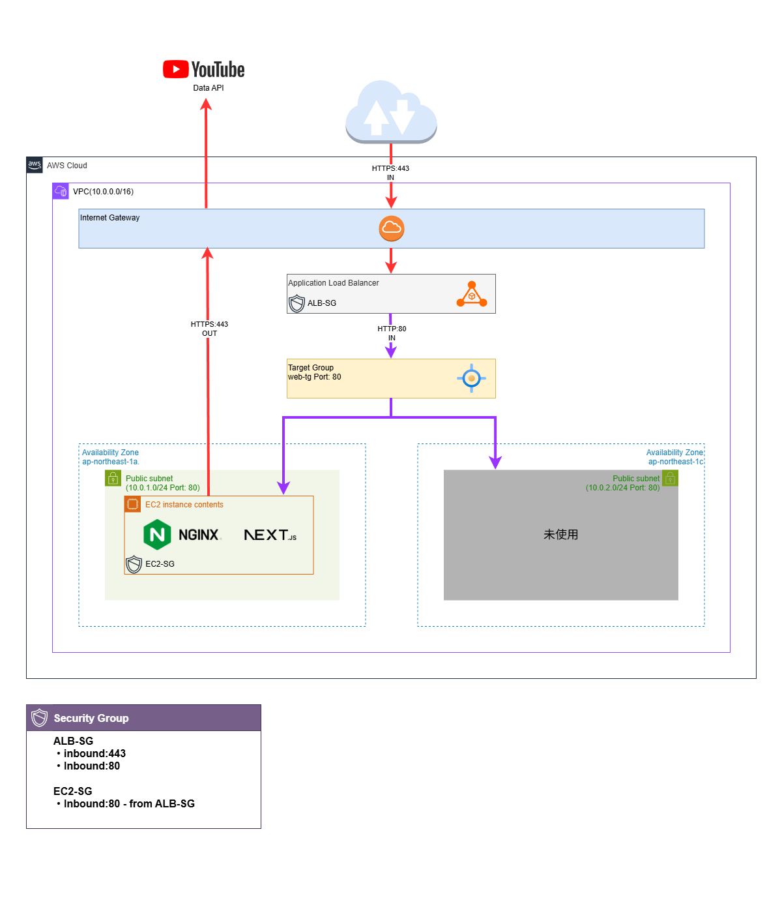

# Terraform × AWS ポートフォリオ

## 概要

Terraform を用いてAWS上にWEB基盤を構築する学習・ポートフォリオ用リポジトリ。
ALB経由でEC2上のNginx/Node.jsアプリへリクエストを転送する。

https://playbass.uk/<br>
※検証用途のため、不要時はterraform destroyすることから、稼働時のみの有効リンク


## 構成図



## 使用技術

### IaC
- Terraform

### Cloud: AWS
- VPC
- EC2 (t3.micro)
- Application Load Balancer
- Target Group
- Public Subnet × 2 (マルチAZ: ap-northeast-1a/1c)
- Internet Gateway
- Route Table
- Security Group × 3
- Key Pair
- Route53

### OS/MW
- Ubuntu 22.04 LTS
- Nginx
- Node.js (Next.js)


## ネットワーク構成
- マルチAZ構成（ap-northeast-1a/1c）
- ALB経由のみHTTPS/HTTPアクセス可能
- HTTPアクセスはALBでHTTPSへリダイレクト
- SSH接続は特定IPに限定


## ポイント

### 自動化
- EC2初期設定はuser_dataで実行
    - パッケージインストール・サービス起動を自動化
    - provisionerはアプリケーションファイルの転送のみに限定
    - terraform applyのみでWEBサーバが起動

### 運用性
- IP/DNSはoutputで管理
    - destroyした時の再構築を容易に

## 開発の流れ

1. EC2をPublic Subnetに配置し、SSHによる疎通確認
2. ~~初期: SecurityGroupでポート80を0.0.0.0/0で開放~~
3. 改善: ロードバランサ経由でのみアクセス可能に変更
4. Nginxの動作確認後、Next.jsアプリケーションを配置

## セットアップ

```bash
# 初期化
terraform init

# 実行計画の確認
terraform plan

# インフラ構築
terraform apply

# インフラ削除
terraform destroy